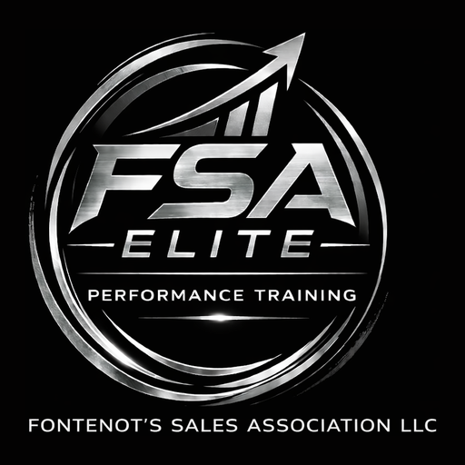

# FSA Elite — Sales Performance Training



> **Built for the Elite Mindset.**

FSA Elite is sales performance training for closers who want more — more confidence, more skill, more production, and more results. Built by Kaygun Fontenot, FSA Elite blends practical training, AI-powered objection handling, and mobile-first design to make practice feel real and results feel earned.

**Sales training. Closer mindset. Real growth.**
Built for the ones who refuse to stay average.

---

## 🚀 Fastest Way to Start Earning

1. **Clone the repo** and navigate to `next-app/`
2. Copy `.env.example` → `.env.local` and set your Stripe keys
3. Run `npm install && npm run dev`
4. Open <http://localhost:3000> — click **Get Early Access** to test checkout
5. Use Stripe test card `4242 4242 4242 4242` (any future expiry, any CVC)
6. Deploy to Vercel (see below) → share your live link → start earning

---

## 📋 Quick Start (Local Dev)

```bash
cd next-app
cp .env.example .env.local
# Edit .env.local and set STRIPE_SECRET_KEY and NEXT_PUBLIC_STRIPE_PUBLISHABLE_KEY
npm install
npm run dev
# Visit http://localhost:3000
```

## 🏗️ Build & Export

```bash
cd next-app
npm run build   # builds Next.js production bundle
npm run export  # exports static HTML to /out (GitHub Pages)
npm run start   # runs production server locally
```

---

## 🔑 Required Environment Variables

| Variable | Description |
|---|---|
| `STRIPE_SECRET_KEY` | Stripe secret key (server-side only — never expose publicly) |
| `NEXT_PUBLIC_STRIPE_PUBLISHABLE_KEY` | Stripe publishable key (safe for client) |
| `NEXT_PUBLIC_BASE_URL` | Full base URL (e.g. `https://yourdomain.com`) |
| `PRICE_AMOUNT_CENTS` | Price in cents (e.g. `4997` = $49.97) |

Copy `next-app/.env.example` to `next-app/.env.local` and fill in your values. **Never commit `.env.local` to git.**

---

## 💳 Stripe Setup

1. Create a [Stripe account](https://dashboard.stripe.com/register) (free).
2. Go to **Developers → API Keys** and copy your **Secret key** and **Publishable key**.
3. Add them to `next-app/.env.local`.
4. Use test mode keys (prefix `sk_test_` / `pk_test_`) for local development.
5. After going live, replace with live keys (prefix `sk_live_` / `pk_live_`).
6. **Set up a Stripe Webhook** at `Developers → Webhooks`:
   - Add endpoint: `https://yourdomain.com/api/stripe-webhook`
   - Events to listen to: `checkout.session.completed`
   - Copy the **Webhook Signing Secret** for verification.

---

## ▲ Vercel Deployment (Recommended)

Vercel is the easiest way to deploy Next.js and keep serverless API routes working:

1. Push this repo to GitHub (already done).
2. Go to [vercel.com](https://vercel.com) → **New Project** → Import `FSA-ELITE-SALES-TRAINING`.
3. Set **Root Directory** to `next-app`.
4. Add your environment variables in the Vercel dashboard (Settings → Environment Variables).
5. Click **Deploy**.
6. Your live URL is your `NEXT_PUBLIC_BASE_URL` — update it in your env vars.

> **Important:** GitHub Pages (the Pages workflow in this repo) is **static-only**. The Stripe checkout API route (`/api/create-checkout-session`) requires a serverless runtime — use **Vercel** or **Render** for the full experience.

---

## 📱 Mobile / Expo Next Steps

Once the web MVP is live and earning:

1. `npx create-expo-app fsaelite-mobile` — bootstrap the Expo app.
2. Connect to the same Supabase/Firebase backend and Stripe APIs.
3. Use `expo-auth-session` for authentication.
4. Build with **EAS Build** for App Store (iOS) and Play Store (Android).
5. Configure `app.json` with bundle identifier, icons, splash, and privacy policy URL.

---

## 🏠 About

**Built by Kaygun Fontenot** — 23 years old, 25× Salesman of the Month in a row, and founder of FSA Elite Sales Performance Training. Building this for closers who refuse to be average, and for his son Oliver.

**Tagline:** Train harder. Close smarter.

---

## 📄 License

Proprietary — © FSA Elite Sales Performance Training. All rights reserved.
